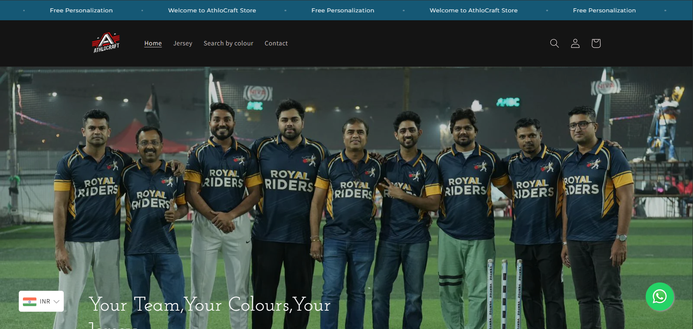
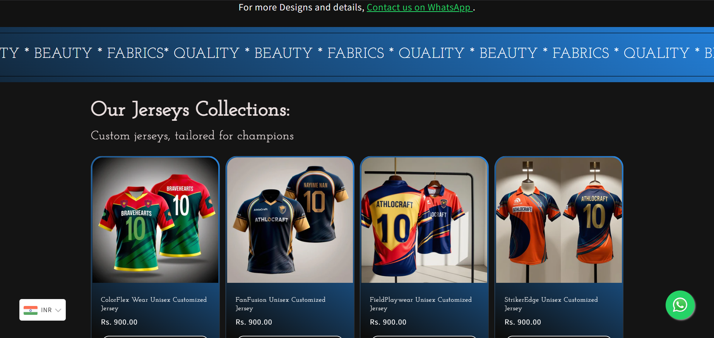
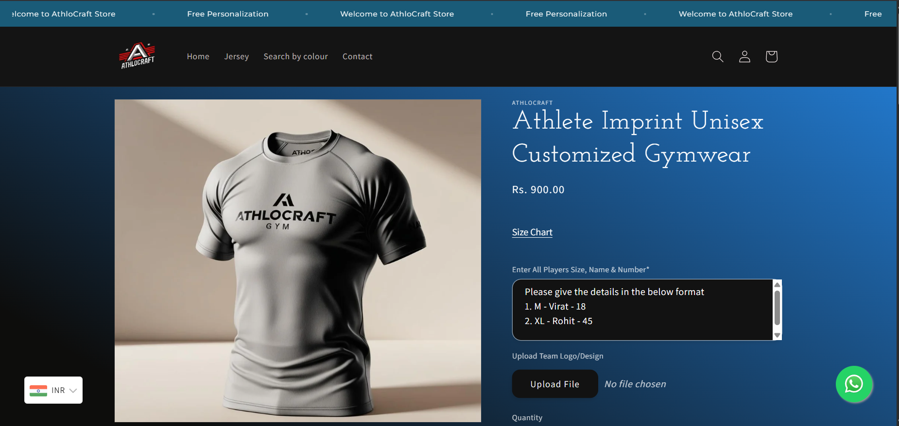
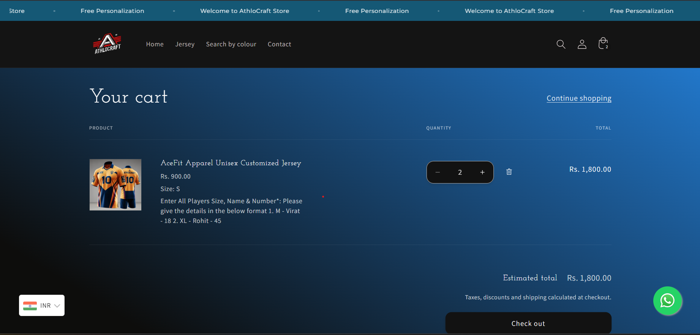
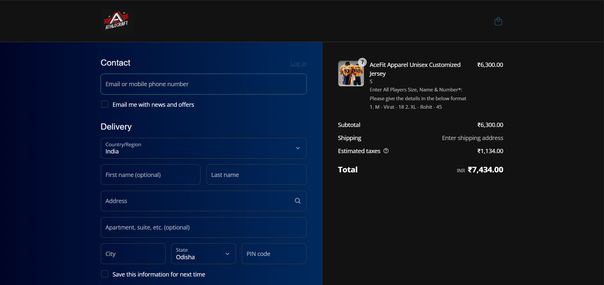
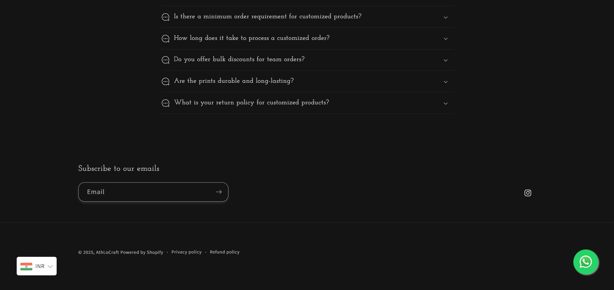

# athlocraft-shopify-site
Live Shopify eCommerce website for fitness apparel built by Ayush Behera.

# AthloCraft – Custom Shopify eCommerce Website 🛍️
Live fitness apparel store built and customized using Shopify by **Ayush Behera**.  
🔗 [Visit Site](https://athlocraft.com)

---

## 💼 What I Did
- Customized Shopify theme and layout
- Added custom code for styling and behavior
- Designed homepage, product pages, and navigation
- Uploaded products and content
- Implemented responsive design and user-friendly layout

---

## 🖼️ Screenshots
### Homepage

### Homepage2

### Product Page

### Cart Page

### Checkout Page

### Footer Page

---

## 📦 Tech Stack
- Shopify
- HTML/CSS
- Shopify Liquid
- Basic JavaScript (for interactivity)
- Canva 
---

## 🔗 Links
- 🔗 [Live Website](https://athlocraft.com)
- 📫 [LinkedIn](https://www.linkedin.com/in/ayush-kumar-behera-057b13293/)  
- 📧 [Email](mailto:beheraayush005@gmail.com)
---

## 📝 License
This project is licensed under the [MIT License](LICENSE).  
You are free to use the code for learning or your own projects with attribution.
